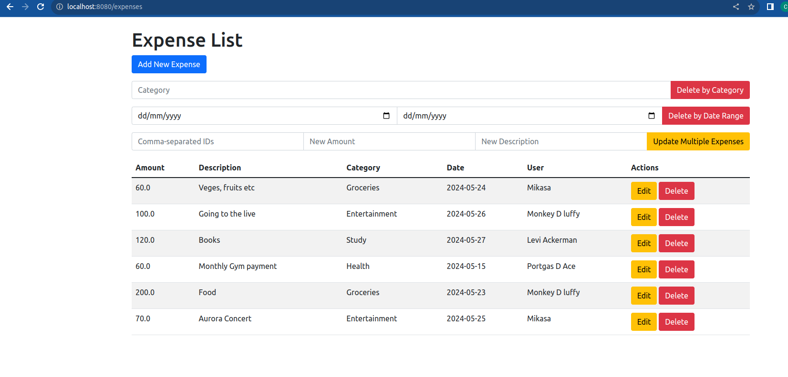
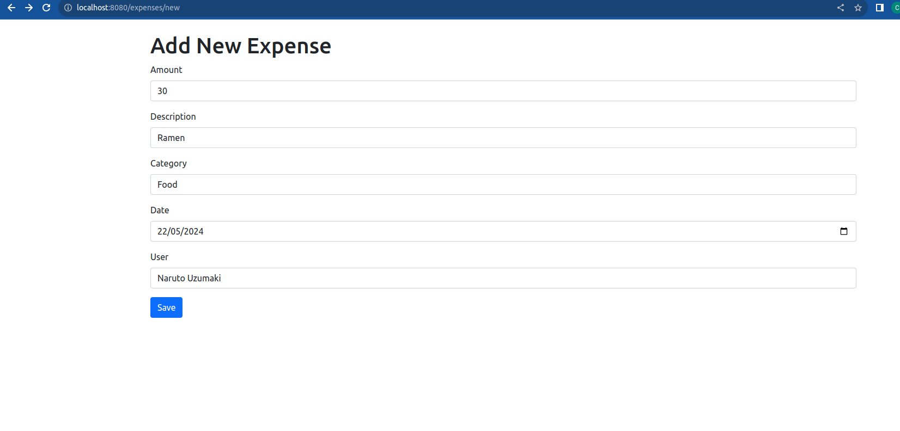
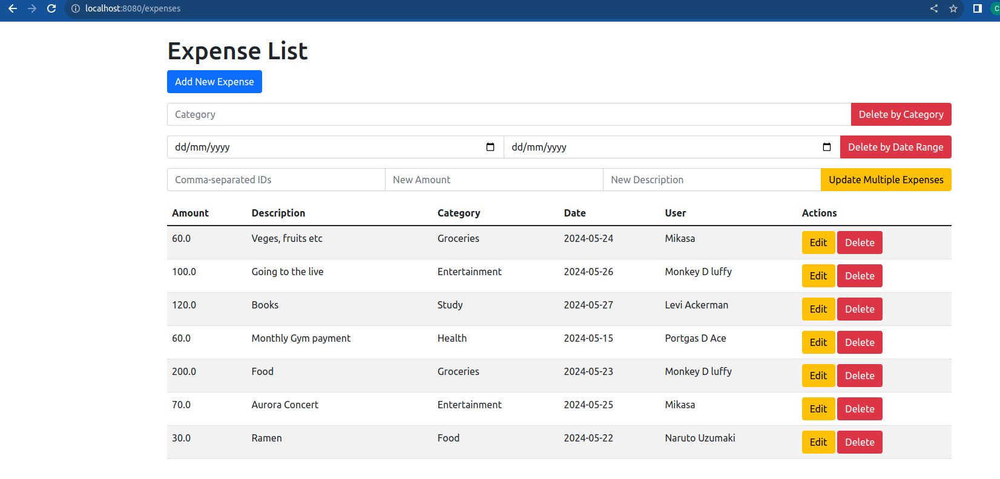
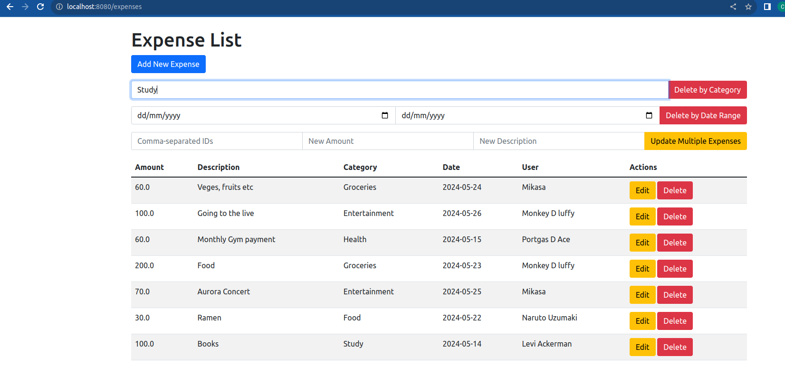

# Assignment: Expense Tracker Application

Assignment created and guided with README file by Safwan kher(https://github.com/safwan-kher).

---
README and instruction by Safwan kher.

## Objective

Develop an Expense Tracker application using Spring Boot, Thymeleaf, Bootstrap 5, PostgreSQL, JPA Hibernate, and JPQL. The application will help users manage their finances by logging expenses, categorizing them, and viewing summaries of their spending over time.

## Requirements

1. **Backend Development**: Use Spring Boot to create RESTful APIs.

2. **Frontend Interface**: Use Thymeleaf and Bootstrap 5 for the user interface.

3. **Database**: Use PostgreSQL for data storage.

4. **ORM**: Use JPA Hibernate for ORM and JPQL for custom queries.

5. **Transactional Operations**: Implement 10 custom operations on the repository with `@Modifying` and `@Transactional`.

## Entities

1. **User**: Represents a user of the application.

2. **Expense**: Represents an expense entry.

### User Entity

- `id`: Long (Primary Key)

- `username`: String

- `password`: String

- `email`: String

### Expense Entity

- `id`: Long (Primary Key)

- `amount`: Double

- `description`: String

- `category`: String

- `date`: LocalDate

- `user`: User (Many-to-One relationship)

## Tasks

### 1. Set Up the Project

- Create a new Spring Boot project.

- Add dependencies for Spring Data JPA, PostgreSQL, and Thymeleaf.

### 2. Configure PostgreSQL Database

- Set up PostgreSQL database and configure application properties.

### 3. Create Entities

- Define `User` and `Expense` entities with appropriate JPA annotations.

### 4. Create Repositories

- Create `UserRepository` and `ExpenseRepository` interfaces extending `JpaRepository`.

### 5. Implement Custom Repository Operations

- Implement 10 custom operations in the `ExpenseRepository` using JPQL and `@Modifying`.

#### Required Custom Operations

1. **Update Expense Amount**: Update the amount of an expense by its ID.

2. **Delete Expense by Category**: Delete all expenses of a specific category.

3. **Update Expense Description**: Update the description of an expense by its ID.

4. **Update Expense Category**: Update the category of an expense by its ID.

5. **Delete Expenses by Date Range**: Delete all expenses within a specific date range.

6. **Update Expense Date**: Update the date of an expense by its ID.

7. **Update Expense User**: Update the user associated with an expense by its ID.

8. **Delete Expenses by User**: Delete all expenses associated with a specific user.

9. **Update Multiple Expenses**: Update multiple expenses based on a list of IDs.

10. **Delete Expense by ID**: Delete an expense by its ID.

### 6. Implement Service Layer

- Create `UserService` and `ExpenseService` classes.

- Annotate service methods with `@Transactional` to ensure transactional integrity.

### 7. Create Controllers

- Create `UserController` and `ExpenseController` to handle HTTP requests.

- Implement endpoints for CRUD operations and custom operations.

### 8. Develop Frontend

- Use Thymeleaf templates and Bootstrap 5 to create user-friendly interfaces.

- Implement forms for inputting expenses, viewing summaries, and categorizing expenses.

### 10. Testing

- Manualy test the servicesand features.

- Ensure all custom operations are tested for correctness.

## Submission

- Submit the complete project with all source code, configuration files, and documentation.

- Include a README file with instructions on how to set up and run the application.

## Evaluation Criteria

- Correctness and completeness of the implementation.

- Proper use of Spring Boot, Thymeleaf, Bootstrap 5, PostgreSQL, JPA Hibernate, and JPQL.

- Implementation of 10 custom repository operations with `@Modifying` and `@Transactional`.

- User-friendly interface.

- Code quality, including readability, organization, and documentation.

Good luck with your assignment!

------

From here by Chizuru Yamauchi

## Project Instructions

### 1. Set Up the Project
1. New Project: From IntelliJ IDEA, create a new Maven project.
2. Dependencies: Add dependencies for Spring Boot, Spring Data JPA, PostgreSQL, Thymeleaf, and Bootstrap 5.
3. On terminal, git init -> git remote add origin git@URL -> git remote -v -> git pull origin main -> git branch -M main -> git add. -> git commit -m "----" -> git push origin main 

### 2. Configure PostgreSQL Database
1. On terminal, sudo -u postgres psql -> CREATE DATABASE expense_tracker; -> \c expense_tracker -> \q

2. Application Properties: Configure the PostgreSQL database connection in the `application.properties` file.

### 3. Add Java source code and html files

## Result: How it looks like and works

1. Home Page

2. User List

3. Add User

4. Expense List

5. Add Expense

6. Custom Operations

